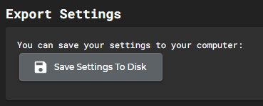
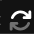

import { DROPBOX_V4_DOWNLOADS_URL } from "@site/src/data/links";

# Upgrading from Version 3

This guide is for players who already have version 3 nex\* packages
(`nexSys3`, `nexMap3`, `nexGui3`) running in Nexus and want to move to the
version 4 rebuild. Version 4 is **not** a drop-in upgrade — it is a clean
rebuild of the runtime, state model, and public API for each package. Complete
every step below before you import any `.nxs` file for a version 4 package.

:::warning Version 3 and version 4 packages cannot run together

None of the version 3 nex\* packages are compatible with their version 4
counterparts. Running `nexSys3`, `nexMap3`, or `nexGui3` alongside any version
4 package will conflict. Remove the version 3 packages first.

:::

## Before you install anything

Complete these steps in order, before you import a single version 4 `.nxs`
file.

### 1. Export your current Nexus settings

Save a local backup of your Nexus client settings so you can restore them if
something goes wrong during the upgrade.

1. Open the **Import/Export** menu in the Nexus client.
2. Click **Save Settings to Disk**.

Keep the exported file somewhere you can find it. You will not need it if the
upgrade goes smoothly, but it is the fastest way back to a known-good state if
it doesn't.

### 2. Remove incompatible version 3 packages

Disable or delete each of the following packages if they are currently
installed:

| Package  | Action                    |
| -------- | ------------------------- |
| nexSys3  | Disable or delete         |
| nexMap3  | Disable or delete         |
| nexGui3  | Disable or delete         |

Deleting is the more thorough option and is recommended if you do not need to
keep the old package around for reference. Disabling is sufficient as long as
it is fully disabled — a partially-loaded v3 package can still conflict with
its v4 replacement.

nexBash3 is not in this table because nexBash4's documentation already lives
alongside it as a rebuild in place — follow the nexBash4
[installation guide](/docs/nexbash/getting-started/installation) for that
transition.

### 3. Resetting your layout (nexGui4 only)

If you are installing **nexGui4**, reset your Nexus client layout before
importing the package. nexGui4 builds its own panel layout, and a v3-era
layout left in place can leave stale or overlapping panels behind.

The layout reset button is in the lower right-hand corner of the Nexus
client:

If you are not installing nexGui4, you can skip this step.

### 4. Log out and start from a fresh browser tab

Once the version 3 packages are removed (and your layout is reset, if
applicable):

1. Log out of the Nexus client normally.
2. Open a fresh browser tab.
3. Log in to the game normally.
4. Install the version 4 `.nxs` files.

Logging out and back in clears any version 3 runtime state still held in the
browser tab, so the version 4 packages start from a clean slate.

## Recommended install order

Grab the `.nxs` files you need from the <a href={DROPBOX_V4_DOWNLOADS_URL}>version 4 Dropbox folder</a>, then install version 4 packages in this order:

1. **nexSys4** — every other package builds on its character state.
2. **nexGui4** *(if you use it)* — reset your layout first, per step 3 above.
3. **nexMap4**
4. **nexBash4** — requires nexSys4 to already be installed and running.

Follow each package's own installation guide for the exact import steps:

- [nexSys4 installation](/docs/nexsys/getting-started/installation)
- [nexGui4 installation](/docs/nexgui/getting-started/installation)
- [nexMap4 installation](/docs/nexmap/getting-started/installation)
- [nexBash4 installation](/docs/nexbash/getting-started/installation)

:::tip Restoring your settings

If you need to fall back to your version 3 setup, use the **Import/Export**
menu's import option with the file you saved in step 1.

:::

## Where your customizations live

Every version 4 package's `.nxs` file includes a dedicated group named
`<package id>.userSettings` — for example, `nexGui4` includes a
`nexGui.userSettings` group. This is the one part of the file that automatic
updates will never overwrite.

Use the `userSettings` group to add your own aliases, triggers, and similar
customizations. Because it is excluded from updates, anything you put there is
preserved when a package ships a new version.

Every other group in the `.nxs` file is managed by the package itself and will
be overwritten automatically as updates become available, so avoid making
manual changes outside of `userSettings` — those changes will be lost the next
time the package updates.
